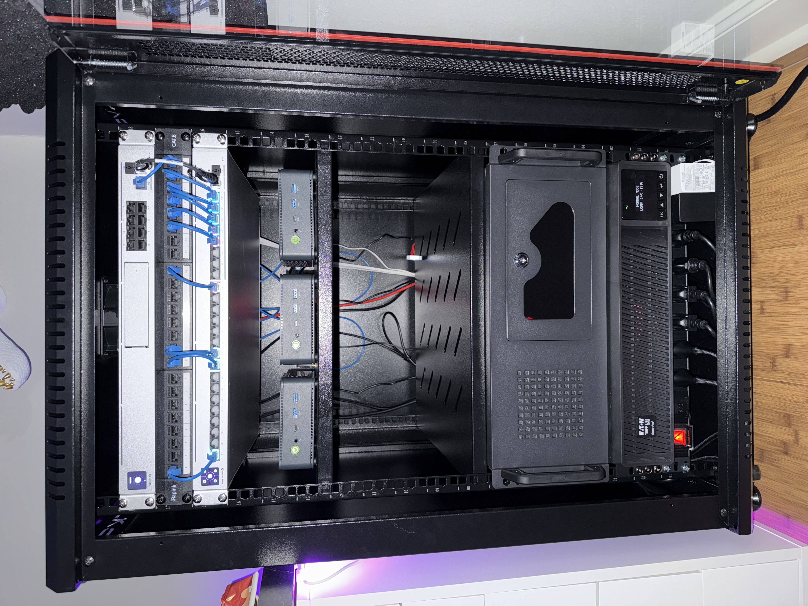

# Project Oswald (aka Homelab)

  

---

  
  
  
  
  
  
  
  
  
  
  
  
  
  
  
  
  
  
  
  
  

---

## Todo

### [Add List](https://github.com/stars/jonahgcarpenter/lists/homelab-todo)

### Problems:

- continue to monitor helper scripts for frigate 16
- fix WoLAN for talos nodes (talos v1.12 in alpha)
- flux oci automation for helm charts
- split GPU between multiple LXCs instead of using passthrough
- node exporter for pve-0

## Hardware

### [2x U7 Lite](https://store.ui.com/us/en/category/all-wifi/products/u7-lite)

### [UDM-SE](https://store.ui.com/us/en/category/all-cloud-gateways/products/udm-se)

- 2 GbE PoE+
- 6 GbE PoE
- 2.5 GbE WAN
- 2 10G SFP+

### [Switch Pro Max 24 PoE](https://store.ui.com/us/en/category/switching-professional-max-xg/products/usw-pro-max-24-poe?variant=usw-pro-max-24-poe)

- 8 GbE PoE+
- 8 GbE PoE++
- 8 2.5 GbE PoE++
- 2 10G SFP+

### [Talos Cluster](https://www.gmktec.com/products/amd-ryzen-7-5825u-mini-pc-nucbox-m5-plus?srsltid=AfmBOorNrOPnRo3cqmPHBq14s82hdWG4dPwe6ntEimRl0J_gWKyXjpC3)

- Ryzen 7 5825U 8C/16T 4.5GHz
- 2x8GB 3200MHz DDR4
- 500GB NVMe
- Dual 2.5GB RJ45

### [PVE 0](https://pcpartpicker.com/user/HeyItsJonah/saved/bkgVD3)

- Ryzen 5 3600 6C/12T 3.6GHz
- 4x16GB 3200MHz DDR4
- 500GB NVMe
- 2x2TB 3.5" Drive
- RTX 3060 8GB VRAM
- Coral TPU USB

### [Home Assistant](https://www.home-assistant.io/yellow/)

- Compute Module 4
- 4GB Ram

### [Tripplite UPS](https://a.co/d/gjzwQbd)

- 1500VA
- 1440W
