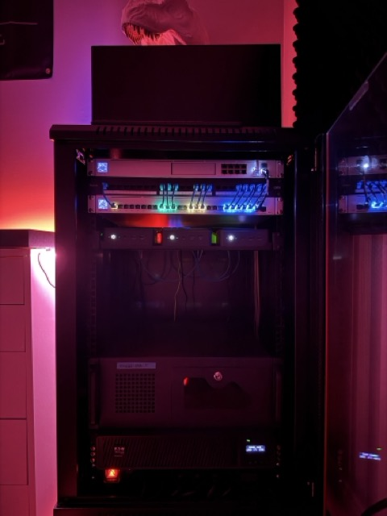

# Project Oswald (aka Homelab)

  

## Todo

### [Add List](https://github.com/stars/jonahgcarpenter/lists/homelab-todo)

## Hardware

### [Rack](https://sysracks.com/product/18u-24-depth-wall-mount-19-enclosure-srw-18-600/?srsltid=AfmBOooVzd62bt7PuxUhbTfJI8JVjD90CEOhDN1CtM2Ggj_Z5FPoegax#)

### [2x U7 Lite](https://store.ui.com/us/en/category/all-wifi/products/u7-lite)

### [UDM-SE](https://store.ui.com/us/en/category/all-cloud-gateways/products/udm-se)

  

- 2 GbE PoE+
- 6 GbE PoE
- 2.5 GbE WAN
- 2 10G SFP+

### [Switch Pro Max 24 PoE](https://store.ui.com/us/en/category/switching-professional-max-xg/products/usw-pro-max-24-poe?variant=usw-pro-max-24-poe)

- 8 GbE PoE+
- 8 GbE PoE++
- 8 2.5 GbE PoE++
- 2 10G SFP+

### [Talos Cluster](https://www.gmktec.com/products/amd-ryzen-7-5825u-mini-pc-nucbox-m5-plus?srsltid=AfmBOorNrOPnRo3cqmPHBq14s82hdWG4dPwe6ntEimRl0J_gWKyXjpC3)

  
  
  
  
  
  
  
  
  
  
  
  
  
  
  
  
  
  

- Ryzen 7 5825U 8C/16T 4.5GHz
- 2x8GB 3200MHz DDR4
- 500GB NVMe
- Dual 2.5GB RJ45

### [Home Assistant](https://www.home-assistant.io/yellow/)

  
  
  
  
  

- Compute Module 4
- 4GB Ram
- 32GB eMMC

### [Mac Mini](https://support.apple.com/en-us/111912)

  

- Intel i3-8100B 4C/4T 3.6GHz
- 8GB Ram
- 128GB SSD

### [PVE 0](https://pcpartpicker.com/user/HeyItsJonah/saved/KfvZzy)

  
  
  
  
  

- Ryzen 5 3600 6C/12T 3.6GHz
- 4x16GB 3200MHz DDR4
- 500GB NVMe
- 2x2TB 3.5" Drive
- RTX 3060 8GB VRAM

### [Tripplite UPS](https://a.co/d/gjzwQbd)

- 1500VA
- 1440W
